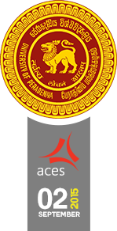  

## Third Engineering Students' Conference at Peradeniya

# Conference Proceedings

## Session 1

# Bio-Medical and Instrumentations

## An Open Biomechanics System using Commodity Hardware

Pumudika Dissanayake, Madushan Adikari and Chathuranga Bamunusinghe[

Read the Paper

https://github.com/cepdnaclk/e10-4yp-all-projects/tree/main/papers/pp1.pdf

View Presentation

https://github.com/cepdnaclk/e10-4yp-all-projects/tree/main/presentations/pr1.pdf

## Behavioral Observation Through Image Processing

Dinidu Bhatiya, Dulanja Wijethunga and Sasith Imbuldeniya[

Read the Paper

https://github.com/cepdnaclk/e10-4yp-all-projects/tree/main/papers/pp2.pdf

View Presentation

https://github.com/cepdnaclk/e10-4yp-all-projects/tree/main/presentations/pr2.pdf

## A Parallel Approach to Blind Source Separation in Brain Computer Interface

Titus Nanda Kumara and Geesara Prathap[

Read the Paper

https://github.com/cepdnaclk/e10-4yp-all-projects/tree/main/papers/pp3.pdf

View Presentation

https://github.com/cepdnaclk/e10-4yp-all-projects/tree/main/presentations/pr3.pdf

## Session 2

# Hardware and Embedded Systems

## Power Analysis Based Side Channel Attack

Hasindu Gamaarachchi and Harsha Ganegoda[

Read the Paper

https://github.com/cepdnaclk/e10-4yp-all-projects/tree/main/papers/pp4.pdf

View Presentation

https://github.com/cepdnaclk/e10-4yp-all-projects/tree/main/presentations/pr4.pdf

## Accelerating Virus Scanning With GPU

Thipakar Sabapathipillai and Sinthuja Kopalakirushnan[

Read the Paper

https://github.com/cepdnaclk/e10-4yp-all-projects/tree/main/papers/pp5.pdf

View Presentation

https://github.com/cepdnaclk/e10-4yp-all-projects/tree/main/presentations/pr5.pdf

## Session 3

# Intelligence and Expert Systems

## Generate Optimized MRP Lot Sizing using Genetic Algorithms Cosidering Supplier Deals

Nipuna Thanura and Udakara Rathnayake[

Read the Paper

https://github.com/cepdnaclk/e10-4yp-all-projects/tree/main/papers/pp6.pdf

View Presentation

https://github.com/cepdnaclk/e10-4yp-all-projects/tree/main/presentations/pr6.pdf

## Feasibility of Using Machine Learning to Access Control in Squid Proxy Server

Supun Weerasekara, Kanchana Ihalagedara and Rajitha Kithuldeniya[

Read the Paper

https://github.com/cepdnaclk/e10-4yp-all-projects/tree/main/papers/pp7.pdf

View Presentation

https://github.com/cepdnaclk/e10-4yp-all-projects/tree/main/presentations/pr7.pdf

## Fraud Detection in SMS with Data Mining

Mohammed Fawzan[

Read the Paper

https://github.com/cepdnaclk/e10-4yp-all-projects/tree/main/papers/pp8.pdf

View Presentation

https://github.com/cepdnaclk/e10-4yp-all-projects/tree/main/presentations/pr8.pdf

## Session 4

# Networking and Information Security

## SDN Testbed for Undergraduate Education

Waruna Chandimal and Madushan Nishantha[

Read the Paper

https://github.com/cepdnaclk/e10-4yp-all-projects/tree/main/papers/pp9.pdf

View Presentation

https://github.com/cepdnaclk/e10-4yp-all-projects/tree/main/presentations/pr9.pdf

## Secure Micropayment Scheme for Newspaper Subscription - Pay Per Article

Fasna Jifry, Mohammed Irfan and Mohammed Rishadhy[

Read the Paper

https://github.com/cepdnaclk/e10-4yp-all-projects/tree/main/papers/pp10.pdf

View Presentation

https://github.com/cepdnaclk/e10-4yp-all-projects/tree/main/presentations/pr10.pdf

# Posters from the Project Symposium

 

View full image
 
https://github.com/cepdnaclk/e10-4yp-all-projects/tree/main/mini/Air-quality-measure.jpg 
Measuring Air Quality in Kandy: Dissanayake DMAM, Rathnayake RMST and Dasanayake TS 
 

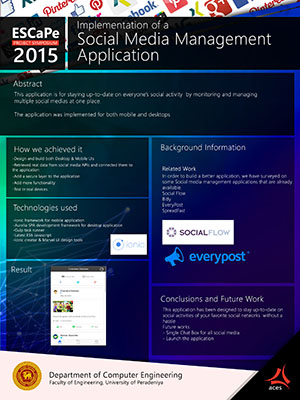

View full image
 
https://github.com/cepdnaclk/e10-4yp-all-projects/tree/main/mini/AllInOne.jpg 
Implementation of a Social Media Management Application: Jayasinghe JPLH, Bandara MGCM and Bandara SMLK 
 

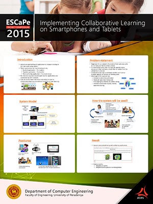

View full image
 
https://github.com/cepdnaclk/e10-4yp-all-projects/tree/main/mini/collaborative_learning.jpg 
Implementing Collaborative Learning on SmartPhones and Tablets: Abeyratne OMTN, Sadhna MJS, and Senadheera WHMUP 
 

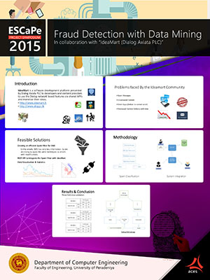

View full image
 
https://github.com/cepdnaclk/e10-4yp-all-projects/tree/main/mini/Fraud-detection-_-data-mining.jpg 
Fraud Detection with Data Mining: Mohammed Fawsan 
 

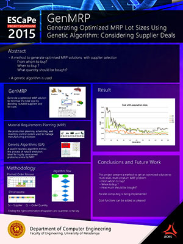]

View full image
 
https://github.com/cepdnaclk/e10-4yp-all-projects/tree/main/mini/GenMRP.jpg 
GenMRP: Nipuna Thanura and Udakara Rathnayake 
 

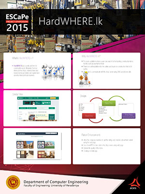

View full image
 
https://github.com/cepdnaclk/e10-4yp-all-projects/tree/main/mini/HardWHERE.jpg 
HardWHERE.lk: Tharinda Ehelepola, Menaka Jayawardena, Irunika Weeraratne, Prassana Rodrigo 
 

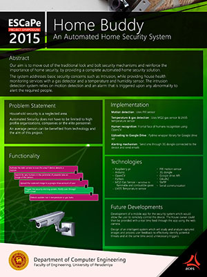

View full image
 
https://github.com/cepdnaclk/e10-4yp-all-projects/tree/main/mini/HomeBuddy_1.jpg 
Home Buddy: Dinanjana Gunaratne 
 

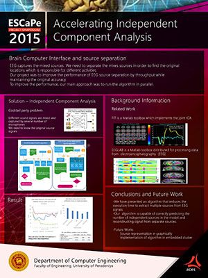

View full image
 
https://github.com/cepdnaclk/e10-4yp-all-projects/tree/main/mini/ICAforBCI.jpg 
ICAforBCI: Titus Nanda Kumara and Geesara Prathap 
 

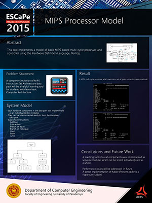

View full image
 
https://github.com/cepdnaclk/e10-4yp-all-projects/tree/main/mini/MIPS.jpg 
MIPS: Malin Prematilake, Buddhi Wickramasinghe 
 

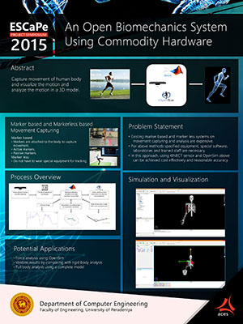

View full image
 
https://github.com/cepdnaclk/e10-4yp-all-projects/tree/main/mini/OPEN-BIOMECHANICS-SYSTEM.jpg 
OPEN-BIOMECHANICS-SYSTEM: Pumudika Dissanayake, Madushan Adikari and Chathuranga Bamunusinghe 
 

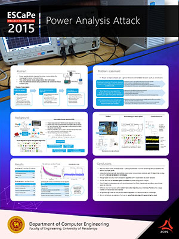

View full image
 
https://github.com/cepdnaclk/e10-4yp-all-projects/tree/main/mini/Power-Analysis-Attack.jpg 
Power-Analysis-Attack: Hasindu Gamaarachchi and Harsha Ganegoda 
 

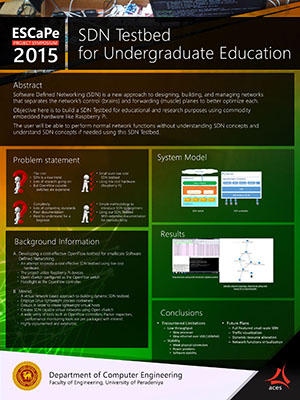

View full image
 
https://github.com/cepdnaclk/e10-4yp-all-projects/tree/main/mini/SDN-testbed.jpg 
SDN-testbed: Weerawardhana JLMN and Chandimal NJAW 
 

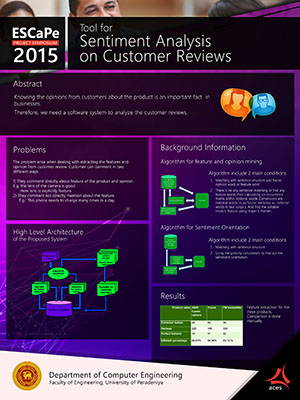

View full image
 
https://github.com/cepdnaclk/e10-4yp-all-projects/tree/main/mini/Sentiment-analysis.jpg 
Sentiment-analysis: Pulojan S, Kabil T and Mokeepan M 
 

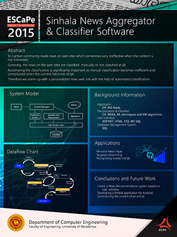

View full image
 
https://github.com/cepdnaclk/e10-4yp-all-projects/tree/main/mini/Sinhalanews-Agg.jpg 
Sinhalanews-Agg: Tharaka Kaluhendiwela, Indunil Prasanna and Dilhan Wanigasooriya 
 

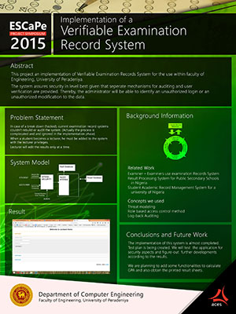

View full image
 
https://github.com/cepdnaclk/e10-4yp-all-projects/tree/main/mini/Verifiable-Ex-record.jpg 
Verifiable-Ex-record: Amila Amunugama, Kasun Samarawickrama and Randunu Yasaranga 
 

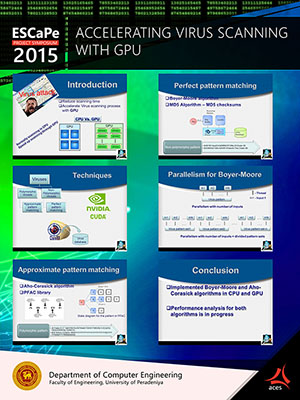

View full image
 
https://github.com/cepdnaclk/e10-4yp-all-projects/tree/main/mini/VirusScanningGPU.jpg 
Thipakar Sabapathipillai and Sinthuja Kopalakirushan 
 

  

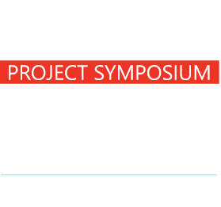

## Third Engineering Students' Conference at Peradeniya

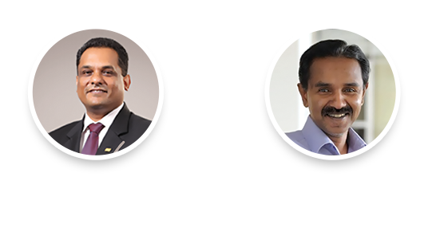   

